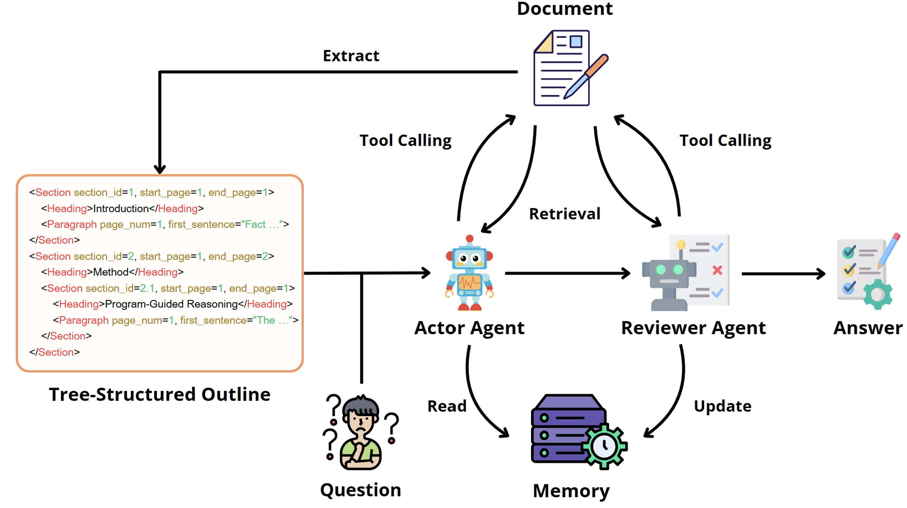

# DocAgent

Official Python implementation for paper *DocAgent: An Agentic Framework for Multi-Modal Long-Context Document Understanding*, accepted by *EMNLP 2025*.

### [[Paper & Supplementary Material](https://aclanthology.org/2025.emnlp-main.893.pdf)]
<p align="center">
  
</p>

### Abstract
Recent advances in large language models (LLMs) have demonstrated significant promise in document understanding and question-answering. Despite the progress, existing approaches can only process short documents due to limited context length or fail to fully leverage multi-modal information. In this work, we introduce DocAgent, a multi-agent framework for long-context document understanding that imitates human reading practice. Specifically, we first extract a structured, tree-formatted outline from documents to help agents identify relevant sections efficiently. Further, we develop an interactive reading interface that enables agents to query and retrieve various types of content dynamically. To ensure answer reliability, we introduce a reviewer agent that cross-checks responses using complementary sources and maintains a task-agnostic memory bank to facilitate knowledge sharing across tasks. We evaluate our method on two long-context document understanding benchmarks, where it bridges the gap to human-level performance by surpassing competitive baselines, while maintaining a short context length.


### Requirements

```Shell
pip install pdfservices-sdk openpyxl pandas PyMuPDF openai pillow
```

### Data Pre-Processing
Prerequisite: Obtain free Adobe PDF Service Client ID and Secret from [here](https://acrobatservices.adobe.com/dc-integration-creation-app-cdn/main.html?api=pdf-services-api).
```bash
cd preprocess
python 1_run_pdf_extract.py --client-id <your_client_id> --client-secret <your_client_secret> \
              --raw-data-dir ../sample_data/ --result-dir ./extract_output/
python 2_process_extracted_data.py --extract-data-dir ./extract_output/ --save-dir ./processed_output/
python 3_make_page_images.py --raw-data-dir ../sample_data/ --save-dir ./processed_output/
```

### Run DocAgent
```bash
python ./run_experiment.py --api-key <your_openai_api_key> \
                           --preprocessed-data-dir ./preprocess/processed_output/ \
                           --save-dir ./sample_results/
```

### Citation

```
@inproceedings{sun-etal-2025-docagent,
    title = "{D}oc{A}gent: An Agentic Framework for Multi-Modal Long-Context Document Understanding",
    author = "Sun, Li  and
      He, Liu  and
      Jia, Shuyue  and
      He, Yangfan  and
      You, Chenyu",
    editor = "Christodoulopoulos, Christos  and
      Chakraborty, Tanmoy  and
      Rose, Carolyn  and
      Peng, Violet",
    booktitle = "Proceedings of the 2025 Conference on Empirical Methods in Natural Language Processing",
    month = nov,
    year = "2025",
    address = "Suzhou, China",
    publisher = "Association for Computational Linguistics",
    url = "https://aclanthology.org/2025.emnlp-main.893/",
    pages = "17712--17727"
}
```